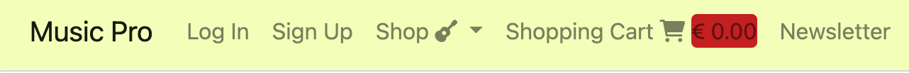
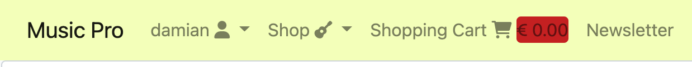
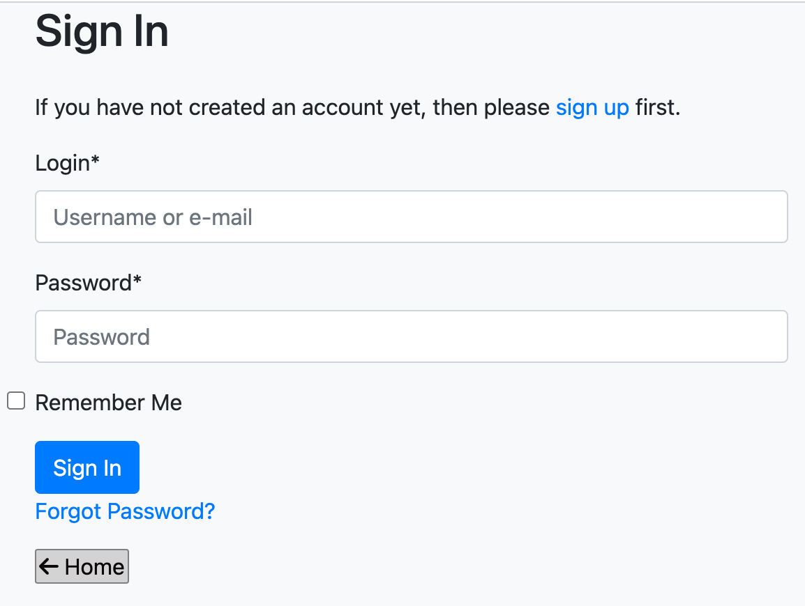
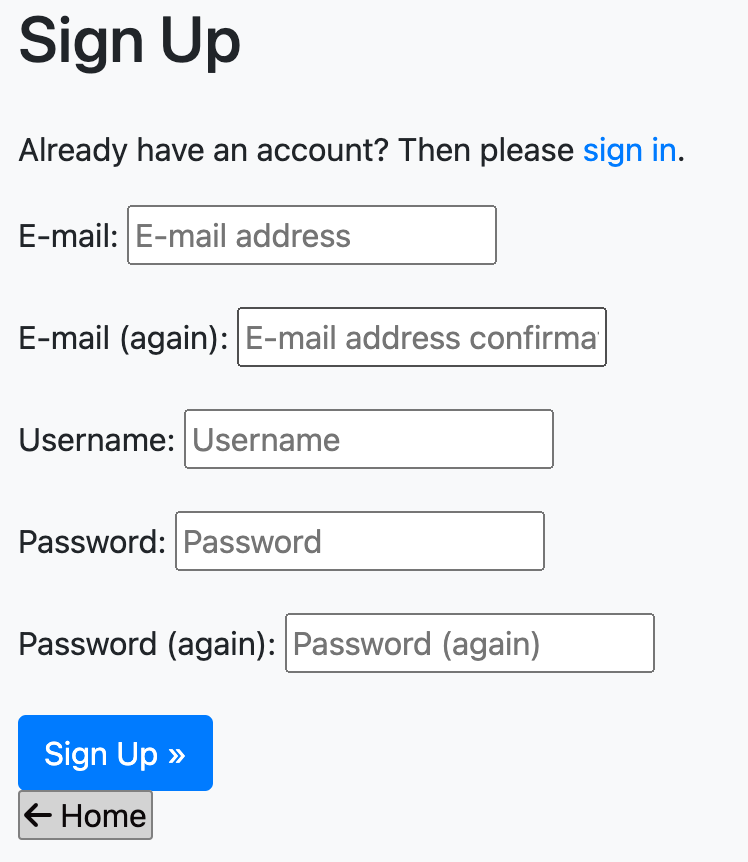
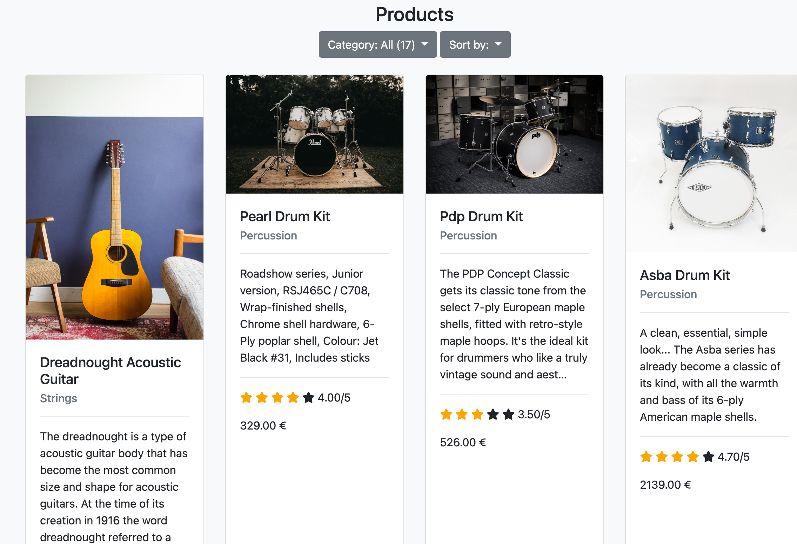
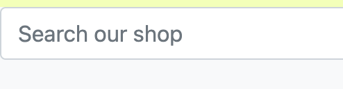
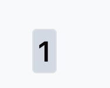
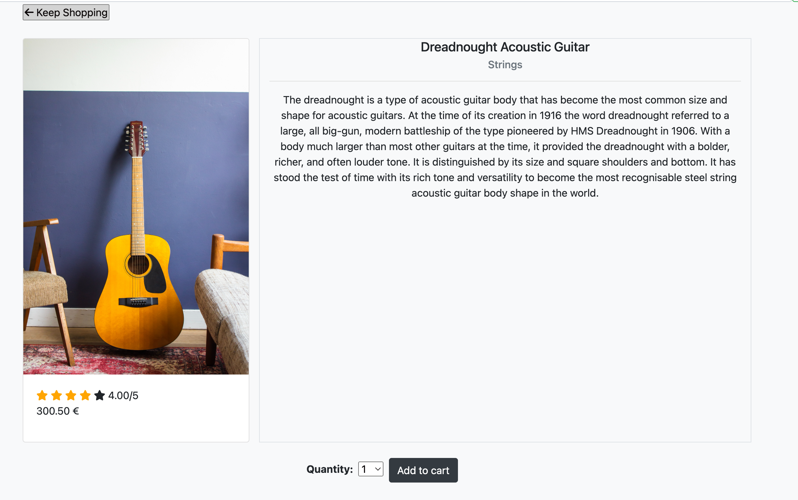

# MS5-Music-Pro-2

See deployed site here: 

## Table of Contents

<small><i><a href='http://ecotrust-canada.github.io/markdown-toc/'>Table of contents generated with markdown-toc</a></i></small>

## A forum for bakers and bread enthusiasts

## Project Goals
The goals for this project are:

Creating a site for a music shop, where users can browse and purchase the instruments they want.

My own goals for this project are:
- Creating a user-friendly e-commerce site
- Improving my skills of web development, especially regarding frameworks (Django), back-end development and python and integrating payment systems into my sites.

## User Goals
- Find music instruments to buy
- Browse through instruments, find them based on keywords or categories
- Compare instruments by price or user rating

## Site Owner Goals
- Be able to manage the site by adding or deleting products.

## User Stories

### Epic 1: 
1. As a first time user I want to see the most important information on the main site so that I know what services it offers.
2. As a user I want to browse through different products so that I can decide which one to buy.
3. As a user I want to be able to order the products by different criteria so that I can find the one I'm looking for.
4. As a user I want to be able to search for keywords so that I can find any product related to that keyword.
5. As a user I want to see more information about a product when I click on it so that I can know more.
6. As a user I want to be able to buy a product without registering to the site.
7. As a customer, I want to receive confirmation that my payment has gone through, or an error message if it hasn't.
8. As a user I want to be redirected to a sign in page if I click on any links or buttons that require me to be logged in.
9. As a use I want to receive feedback on my actions so that I know whether they have been executed correctly.
10. As a User I want to be able to sign up so that I can get access to functions restricted to registered users.
11. As a registered user, I want to save my delivery information so that the delivery form gets filled automatically.
12. As a registered user, I want to be able to see all the orders I did in the past.
13. As a registered user I want to be able to change my default delivery information.
14. As a registered user, I want to be able to rate a product I have bought to express how happy I was with it.
15. As a registered user, I want to be able to ask questions about a product.
16. As the site owner, I want to be able to create, delete and update products.
17. As the site owner, I want to be able to answer questions and comments from my customers.
18. As the site owner, I want to have access to an admin panel, so that I can delete inappropriate comments and users.

19. As a user I want to get redirected to the sign in/sign up page if I click on any links or buttons that require me to be logged in so that I can sign in or sign up easily.
20. As a user I want to get feedback from the site on the actions I have performed so that I can see whether my action was carried out correctly or not.
21. As a user I want to be able to get back to the home page in one click so that I can navigate the site easily.

22. As a user I want to sign up and log in so that I can perform actions reserved for registered users.
23. As a registered user I want to be able to log out so that I have more security.
24. As a registered user I want to be able to access my past orders.
### Epic 4: Admin
25. As a site admin I want to be able to add or delete products from the store.

## Design Choices
My goal was to create a simple site with a clean and friendly look. I chose a soft yellow, black and red as my main colors, in order to recall the background-image of the landing page.

### Wireframes
I used balsamiq for the wireframes. The final wireframe is a bit different from the first version, as i made some changes while creating the project, in accordance with Agile principles.

Wireframes for mobile

Wireframes for tablet

Wireframes for desktop

## Structure
### Code directories
Music Pro was created with the Django framework, so it is divided into apps:
- musicpro is the main app, where settings.py can be found
Other apps include:
- products
- home
- profiles
- checkout
- cart
- newsletter

Other directories:
- static: This is where the custom CSS and JavaScript files for this project are stored.
- templates: This is where all the templates (html files) are stored, as is usual with Django.
- docs: in this directory I stored all the images and screenshots needed for this Readme file.

### Database
This website relies on a database for its function. I used postgreSQL as database both for development and for the deployed version.

### Data Models
Data Models are a central part of this project. These are the data models I used:

- User: This is a built-in data model that comes with Django. It is used for authentication and authorisation.
- Product: Custom data model for the products you can see on the site.
- Order: Custom data model for defining orders.
- OrderLineItem: Custom data model for defining single items in an order
- Profile: Custom model for the user profile

### Data Model scheme

This scheme was made with Lucidchart.

## Features 

### Navbar

The navbar is sticky and thus offers a quick and easy way to return to the Homepage or to navigate to other pages on the site.
For users that are logged out, it will display the option to sign up or log in, and for users who are already logged in it will display their username (so they know that they are logged in) and if they are a superuser or staff member they will see a link to the admin panel.

Navbar when not logged in

Navbar when logged in (user has admin or staff privilege)

### Home Page

The landing page is focussed on the image of a burning guitar and is kept very simple. The only button on this page will bring the user to the products page, where all the products are listed.

Home page

User stories covered: "As a first time user I want to see the most important information on the main site so that I know what services it offers."

### User log in and sign up
These are the forms used to sign the user up or log them in. If an anonymous user tries to access a forbidden view, they will be redirected to the login page.

Log in

Sign up

User stories covered:
- "As a user I want to get redirected to the sign in/sign up page if I click on any links or buttons that require me to be logged in so that I can sign in or sign up easily."
- "As a user I want to sign up and log in so that I can perform actions reserved for registered users."

### Products page
This is where the user can see all the products in the store. The user can filter the products by category and sort them by price and rating. If the user has used the search bar, they can also filter the results to their search by category and sort it.

If there are multiple pages, the user will be able to click on the next page and still keep the same query strings. This is thanks to a custom template tag I adapted, which allows to keep all query strings except if one is modified. The same custom template tag is used for the Category and "sort by" dropdowns, so that there can always be more than just one query string.

Products

User stories covered:
- "As a user I want to browse through different products so that I can decide which one to buy."
- "As a user I want to be able to order the products by different criteria so that I can find the one I'm looking for."

### Search Bar
This is an important tool for customers, who can use it to search for any keyword they like. The site will then display any products who have that keyword in their name, category or description. The user will also be able to filter the search results by category and to sort them by price or rating.

Search Bar

User stories covered:
- "As a user I want to be able to search for keywords so that I can find any product related to that keyword."

### Pagination
The products page uses Django's pagination, which has been customised. Every page displays a maximum of 24 products. The pagination part displays the first, last, current, previous and subsquent pages. It has been tested for over 1000 products.

Pagination

### Product details
By clicking on a product image, the users can see the product details page. Here, all the product information are displayed (name, category, full description, rating, price) and the users can choose the quantity they want to add to the cart. The quantity they can add to the cart is determined by the variable "availability", which is set to 10 by default. If the product is already in the cart, the user will see that and they have the possibility to update the quantity from the product details page.

By clicking on "keep shopping", the user will be brought back to the products page, but with the same query strings they had before clicking on the product. This allows for a smoother user experience because the user does not have to set the filter or category again each time they come back from a product detail page.

Product details

<!-- ### Leaving Comments
This is where registered users can leave a comment.

Comments

 -->

<!-- User stories covered:
- 11. As a registered user I want to leave comments under posts so that I can discuss topics with other users. -->

## Technologies used
The primary technology used here was the Django framework
### Languages
- HTML5 for building the web pages
- CSS3 for styling the web pages (although I used mainly Bootstrap 5)
- JavaScript for validating the media input field 
- Python 3 for the backend programming and database manipulation

### Other technologies
Apart from the programming languages, I have used the following:

- [Heroku](https://www.heroku.com/) for deploying and hosting my site.
- [Git](https://git-scm.com/) and [GitHub](https://github.com/) for version control and storage of my code 
- [Cloudinary](https://cloudinary.com/) for hosting the image files
- [postgreSQL](https://www.postgresql.org/) as a database
- [Balsamiq Wireframes](https://balsamiq.com/) for creating my wireframes
- [Lucidchart](https://www.lucidchart.com/pages/de) for creating the data schema for my models
- [Font Awesome](https://fontawesome.com/) - All icons are from Font Awesome
- [Google Fonts](https://fonts.google.com/) - I used the Roboto and Open Sans fonts from Google Fonts
- [VSCode](https://code.visualstudio.com/) - The code editor where I wrote all my code.
- [Mockaroo](https://mockaroo.com/) - for creating fixtures to test my database

## Testing

### HTML
No errors were returned when passing through the official [W3C validator](https://validator.w3.org/).
Please see the screenshots for HTML here: [HTML validation](https://github.com/Damianjacob/MS4_breadit/tree/main/breadit/docs/validation/html-validation) .

### CSS
No errors were found when passing through the [Jigsaw validator](https://jigsaw.w3.org/css-validator/).

### Python
All my Python documents passed through the PEP8 validator without any errors. The result was the following for all of them.

### JavaScript
My JavaScript file passed through the JSHint validation without any errors.

### LIGHTHOUSE
<!-- All of the pages in this site have achieved a total score of at least 89 in Google Lighthouse (for performance, accessibility, SEO and best practices.) -->
You can see the results [here]().

### Devices
<!-- The testing was done on a Mac Mini and iPhone. I tested Google Chrome and Safari, and the site was functional and responsive for all devices (I used the list of devices available in the web inspector). -->

## Bugs

- While trying to run the server after having set up Amazon S3 as default file storage, I had issues accessing my admin page. It raised "ValueError: Required parameter name not set" and pointed to the Django static tag where the CSS link was defined. 
Fix: In settings.py I deleted the STATICFILES_STORAGE variable (which I had set to the boto link, needed for AWS) and only left DEFAULT_FILE_STORAGE. This resolved the issue.

- My first deployment caused the Heroku app to crash. This was because in the Procfile I had used the Heroku app name instead of the Django project name.
Fix: Changed "[heroku-appname].wsgi" to "[django-projectname].wsgi"

- After adding custom CSS to my project and pushing the changes to Heroku, I'd get a "Server Error 500".
Fix: 

- When trying to log into my admin page, I got a "Forbidden" error where it demanded a CSRF token (which should already be taken care of).
Fix: clear cookies from browser. https://stackoverflow.com/questions/29573163/django-admin-login-suddenly-demanding-csrf-token

## Deployment

### Creating the Github repository and cloning it
- Go to Github to your profile
- Go to repositories and click on "New"
- Choose a name and the settings you prefer, then click on "create repository"
- Go to the repository
- Click on "code", and copy the HTTPS address
- In VSCode, click on "Clone Git repository"
- Paste the address of your repository and press enter. 

### Deploying to Heroku
- Create account at Heroku
- Create new app, give it a name and select your region
- Go to Settings
- Under Config Vars add your secret data (for example environment variables like API keys)
- Add Heroku Postgres Add-on
- In the deployment tab, select the preferred deployment method (I chose Github)
- Connect your app to your GitHub repository
- Enable automatic deploys
- For any issues it's useful to consult the build log in the activity tab
- Before going public, it's very important to set DEBUG to false in the django settings.py file.

## Credits

### Tutorials and other resources

I have used the [Django Tutorial](https://docs.djangoproject.com/en/4.0/intro/tutorial01/) and read the Django documentation extensively during the creation of this project.

Tutorial followed to use AWS for file storage: https://www.section.io/engineering-education/using-amazon-web-service-for-django-media-files-storage/#setting-up-the-django-application

Documentation for using AWS' S3 service with the django-storage library : https://django-storages.readthedocs.io/en/latest/backends/amazon-S3.html

YouTube tutorial on how to set up AWS S3 for file storage: https://www.youtube.com/watch?v=nzLMA9WZqMM

Custom template tag for keeping querystrings when going to another page or to a different category
https://simpleisbetterthancomplex.com/snippet/2016/08/22/dealing-with-querystring-parameters.html