# MS5-Music-Pro-2

See deployed site here: <a href="https://ms5-music-pro.herokuapp.com/">MusicPro</a>

## Table of Contents

<small><i><a href='http://ecotrust-canada.github.io/markdown-toc/'>Table of contents generated with markdown-toc</a></i></small>

## A Music Shop site for purchasing instruments

## Project Goals
The goals for this project are:

Creating a site for a music shop, where users can browse and purchase the instruments they want.

My own goals for this project are:
- Creating a user-friendly e-commerce site
- Improving my skills of web development, especially regarding frameworks (Django), back-end development and python and integrating payment systems into my sites.

## User Goals
- Find music instruments to buy
- Browse through instruments, find them based on keywords or categories
- Compare instruments by price or user rating

## Site Owner Goals
- Be able to manage the site by adding or deleting products.
- Manage user questions

## Business Model

The vision of this business is to be a user-centric music shop, with an easy layout and friendly interface. Our target customers are musicians, be they beginners or professionals, who trust us with their needs.
The channels to be used will be social media, such as Facebook. We also plan to set up a YouTube channel to demonstrate the usage of our instruments, which will increase our reach and our popularity. 

## User Stories

1. As a first time user I want to see the most important information on the main site so that I know what services it offers.
2. As a user I want to browse through different products so that I can decide which one to buy.
3. As a user I want to be able to order the products by different criteria so that I can find the one I'm looking for.
4. As a user I want to be able to search for keywords so that I can find any product related to that keyword.
5. As a user I want to see more information about a product when I click on it so that I can know more.
6. As a user I want to be able to buy a product without registering to the site.
7. As a customer, I want to receive confirmation that my payment has gone through, or an error message if it hasn't.
8. As a user I want to be redirected to a sign in page if I click on any links or buttons that require me to be logged in.
9. As a use I want to receive feedback on my actions so that I know whether they have been executed correctly.
10. As a User I want to be able to sign up so that I can get access to functions restricted to registered users.
11. As a registered user, I want to save my delivery information so that the delivery form gets filled automatically.
12. As a registered user, I want to be able to see all the orders I did in the past.
13. As a registered user I want to be able to change my default delivery information.
14. As a registered user, I want to be able to rate a product I have bought to express how happy I was with it.
15. As a registered user, I want to be able to ask questions about a product.
16. As the site owner, I want to be able to create, delete and update products.
17. As the site owner, I want to be able to answer questions and comments from my customers.
18. As the site owner, I want to have access to an admin panel, so that I can delete inappropriate comments and users.

19. As a user I want to get redirected to the sign in/sign up page if I click on any links or buttons that require me to be logged in so that I can sign in or sign up easily.
20. As a user I want to get feedback from the site on the actions I have performed so that I can see whether my action was carried out correctly or not.
21. As a user I want to be able to get back to the home page in one click so that I can navigate the site easily.

22. As a user I want to sign up and log in so that I can perform actions reserved for registered users.
23. As a registered user I want to be able to log out so that I have more security.
24. As a registered user I want to be able to access my past orders.

25. As a site admin I want to be able to add or delete products from the store.

## Design Choices
My goal was to create a simple site with a clean and friendly look. I chose a soft yellow, black and red as my main colors, in order to recall the background-image of the landing page.

### Wireframes
I used balsamiq for the wireframes. The final wireframe is a bit different from the first version, as i made some changes while creating the project, in accordance with Agile principles.

Wireframes for mobile

Wireframes for tablet

Wireframes for desktop

## Structure
### Code directories
Music Pro was created with the Django framework, so it is divided into apps:
- musicpro is the main app, where settings.py can be found
Other apps include:
- products
- home
- profiles
- checkout
- cart
- newsletter
- questions

Other directories:
- static: This is where the custom CSS and JavaScript files for this project are stored.
- templates: This is where all the templates (html files) are stored, as is usual with Django.
- docs: in this directory I stored all the images and screenshots needed for this Readme file.

### Database
This website relies on a database for its function. I used postgreSQL as database both for development and for the deployed version.

### Data Models
Data Models are a central part of this project. These are the data models I used:

- User: This is a built-in data model that comes with Django. It is used for authentication and authorisation.
- Product: Custom data model for the products you can see on the site.
- Order: Custom data model for defining orders.
- OrderLineItem: Custom data model for defining single items in an order
- Profile: Custom model for the user profile
- Rating: Custom model used for rating products
- UserQuestion: Custom model used to represent the questions users can ask for each product
- OwnerReply: Custom model which represents the owner's reply to user questions

## Features 

### Navbar

The navbar offers a quick and easy way to return to the Homepage or to navigate to other pages on the site.
For users that are logged out, it will display the option to sign up or log in, and for users who are already logged in it will display their username (so they know that they are logged in) and if they are a superuser they will see a link to the the product management page.

Navbar when not logged in

Navbar when logged in (user has admin or staff privilege)

### Home Page

The landing page is focussed on the image of a burning guitar and is kept very simple. The only button on this page will bring the user to the products page, where all the products are listed.

Home page

User stories covered: "As a first time user I want to see the most important information on the main site so that I know what services it offers."

### User log in and sign up
These are the forms used to sign the user up or log them in. If an anonymous user tries to access a forbidden view, they will be redirected to the login page.

Log in

Sign up

User stories covered:
- "As a user I want to get redirected to the sign in/sign up page if I click on any links or buttons that require me to be logged in so that I can sign in or sign up easily."
- "As a user I want to sign up and log in so that I can perform actions reserved for registered users."

### Products page
This is where the user can see all the products in the store. The user can filter the products by category and sort them by price and rating. If the user has used the search bar, they can also filter the results to their search by category and sort it.

If there are multiple pages, the user will be able to click on the next page and still keep the same query strings. This is thanks to a custom template tag I adapted, which allows to keep all query strings except if one is modified. The same custom template tag is used for the Category and "sort by" dropdowns, so that there can always be more than just one query string.

If any product is unavailable, it will be greyed out with a red disclaimer and the users will not be able to interact with it. The owner can still edit/restock or delete that product. See [product_details](#product-details) for more information about the availability functionality.

Products

Unavailable product

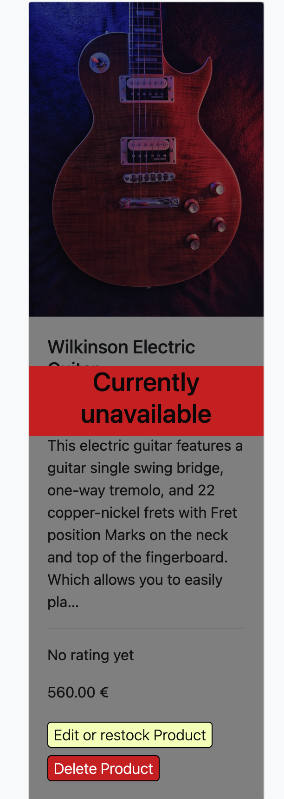

User stories covered:
- "As a user I want to browse through different products so that I can decide which one to buy."
- "As a user I want to be able to order the products by different criteria so that I can find the one I'm looking for."

### Search Bar
This is an important tool for customers, who can use it to search for any keyword they like. The site will then display any products who have that keyword in their name, category or description. The user will also be able to filter the search results by category and to sort them by price or rating.

Search Bar

User stories covered:
- "As a user I want to be able to search for keywords so that I can find any product related to that keyword."

### Pagination
The products page uses Django's pagination, which has been customised. Every page displays a maximum of 24 products. The pagination part displays the first, last, current, previous and subsquent pages. It has been tested for over 1000 products.

Pagination

### Product details
By clicking on a product image, the users can see the product details page. Here, all the product information are displayed (name, category, full description, rating, price) and the users can choose the quantity they want to add to the cart. The quantity they can add to the cart is determined by the attribute "availability", which will diminish each time a user buys a product. Once the availability reaches 0, the product is shown as unavailable and the owner will have to restock it. If the product is already in the cart, the user will see that and they have the possibility to update the quantity from the product details page.

Registered users have the possibility to rate the products by clicking on the stars under the product image.

By clicking on "keep shopping", the user will be brought back to the products page, but with the same query strings they had before clicking on the product. This allows for a smoother user experience because the user does not have to set the filter or category again each time they come back from a product detail page.

Product details

Product details: update quantity

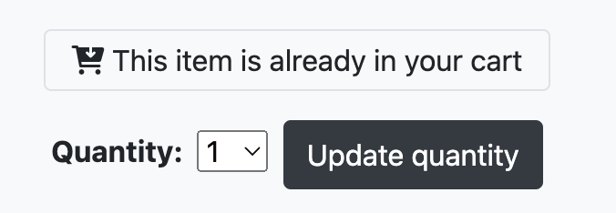

User stories covered:
- "As a user I want to see more information about a product when I click on it so that I can know more."

### Cart
The cart is where the user can see all the items they have selected so far.
They can update the quantity of each item, by simply selecting from a dropdown.
The number in the dropdown is again based on the "availability" variable, which is set to 10 by default. This way they don't have to click on other buttons to update the quantity, which makes the user experience smoother.
The can also remove items from the cart.
At the bottom of the cart, there is a button for secure checkout.

Shopping Cart

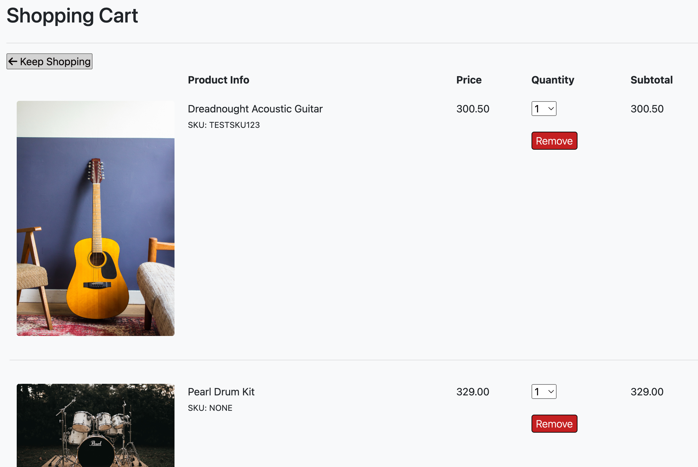

### Checkout
Here is where the user can fill out their billing information, and save it if they have a registered account.
The payment is made possible by stripe. A message and a confirmation will be sent to the user in case of a successful payment. The user does not need to be registered in order to pay.

Checkout

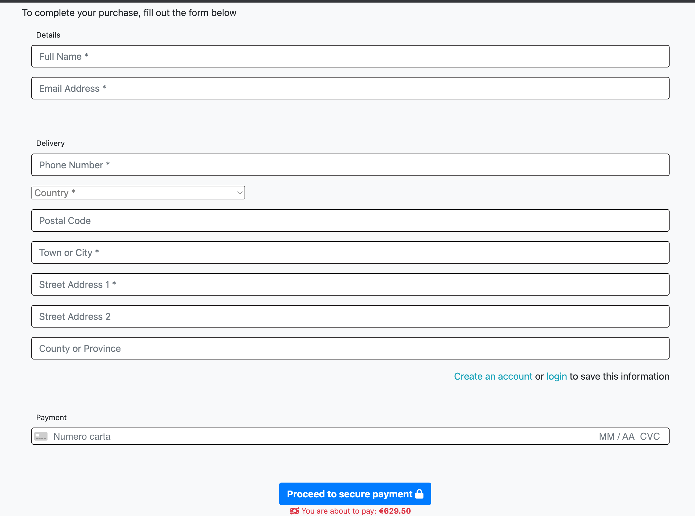

User stories covered:
- "As a user I want to be able to buy a product without registering to the site."
- "As a customer, I want to receive confirmation that my payment has gone through, or an error message if it hasn't."
- As a registered user, I want to save my delivery information so that the delivery form gets filled automatically.

### Newsletter
The users are able to subscribe to a newsletter. Once they insert their email, if it's valid and has not been added to the database, the user will get a confirmation message and a confirmation email. If their email is already in the database, they will receive a message that tells them so.

Newsletter

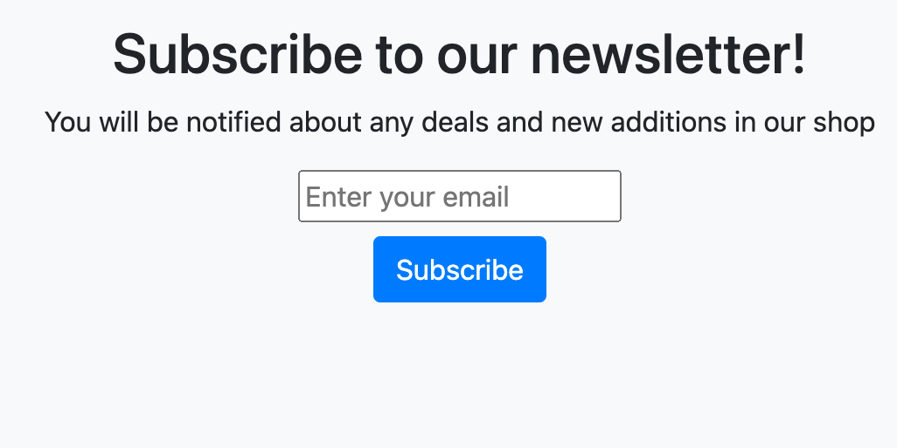

### Profile
Here the user can see their default billing information and a history of their past orders. They can click on the single orders to see the full order.

Profile

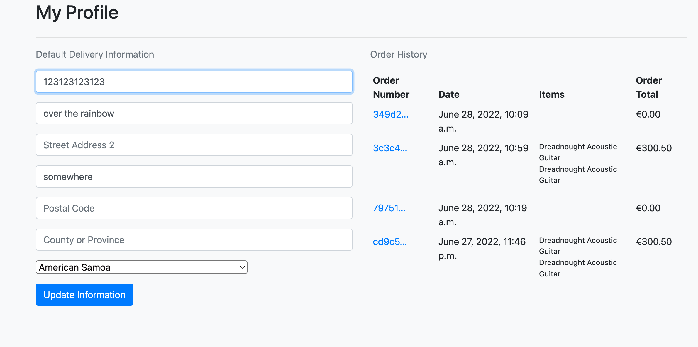

### User Questions
With this feature, all logged-in users are able to ask questions about the site's products. Only the site owner can reply to the questions. The user questions and owner replies are styled differently, so as to make them easily distinguishable.
The site owner has access to a questions view, where all the user questions are listed, both those which have been answered and those which have not been answered yet. This allows the owner to see all unanswered questions at one glance, and they can reply to each question without leaving the questions view.

User questions and owner replies

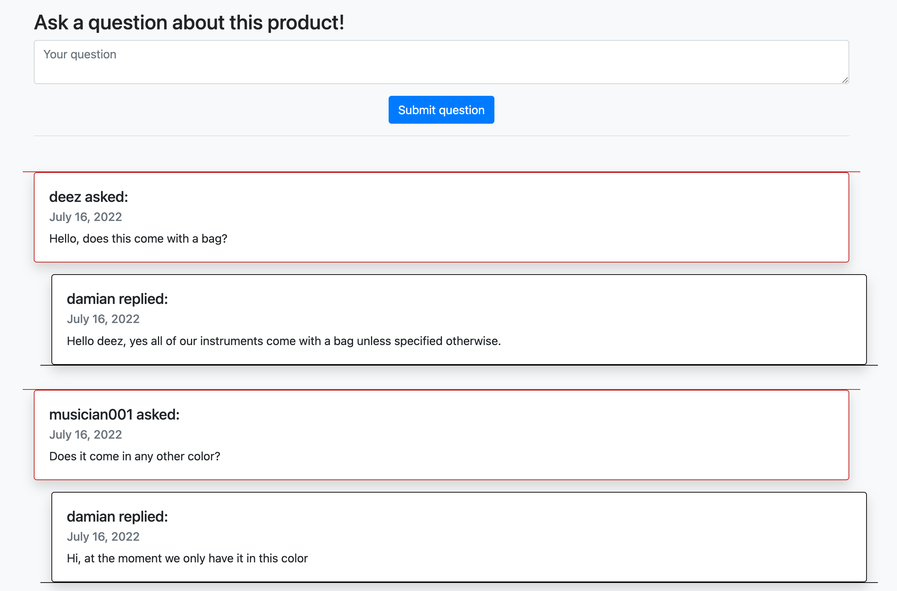

Questions view for owner

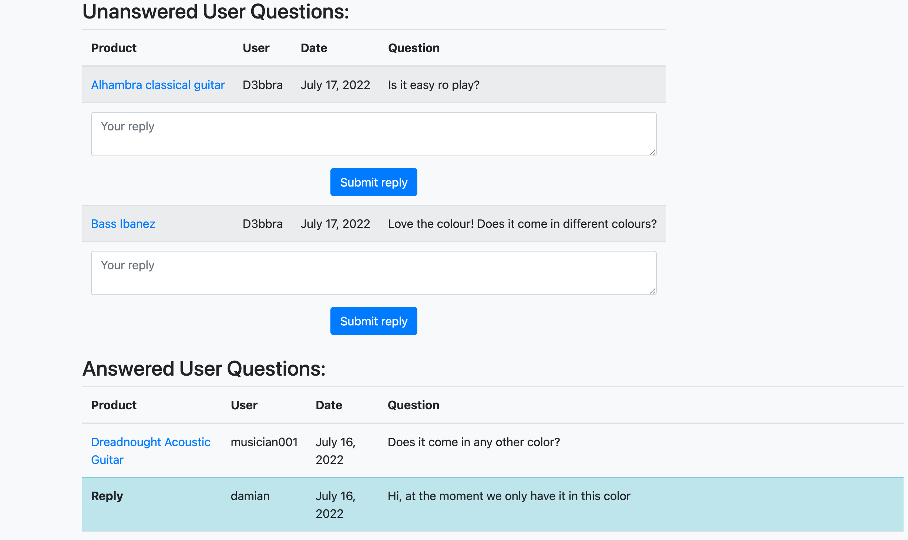

## Technologies used
The primary technology used here was the Django framework
### Languages
- HTML5 for building the web pages
- CSS3 for styling the web pages (although I used mainly Bootstrap 5)
- JavaScript for the stripe functionality and for DOM modification. 
- Python 3 for the backend programming and database manipulation
- PostgreSQL as a database.

### Other technologies
Apart from the programming languages, I have used the following:

- [Heroku](https://www.heroku.com/) for deploying and hosting my site.
- [Git](https://git-scm.com/) and [GitHub](https://github.com/) for version control and storage of my code 
- [Amazon Web Services](https://aws.amazon.com/) for hosting the image files
- [postgreSQL](https://www.postgresql.org/) as a database
- [Balsamiq Wireframes](https://balsamiq.com/) for creating my wireframes
- [Font Awesome](https://fontawesome.com/) - All icons are from Font Awesome
- [VSCode](https://code.visualstudio.com/) - The code editor where I wrote all my code.
- [Mockaroo](https://mockaroo.com/) - for creating fixtures to test my database

## Testing

### HTML
No errors were returned when passing through the official [W3C validator](https://validator.w3.org/), with the exception of a "No p element in scope but a p end tag seen".
I was not able to understand where this comes from, it seemed only to appear on some pages and in generated code.
Please see the screenshots for HTML here: [HTML validation](https://github.com/Damianjacob/MS5-Music-Pro-2/tree/main/assets/images/validation) .

### CSS
No errors were found when passing through the [Jigsaw validator](https://jigsaw.w3.org/css-validator/).
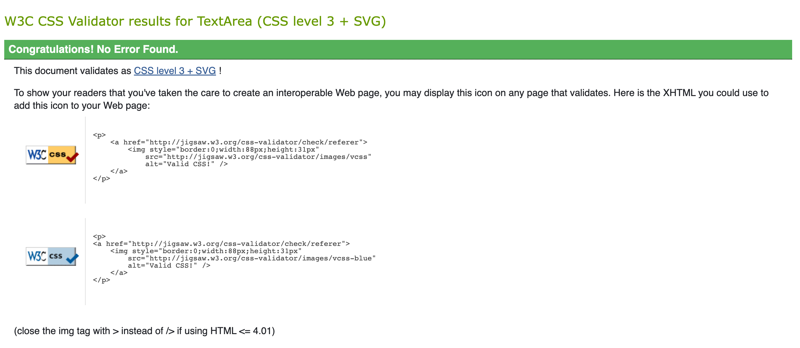

### Python
I used autopep8 for all my python files, and then checked them against the PEP8 validator. The result was the following for all of them.
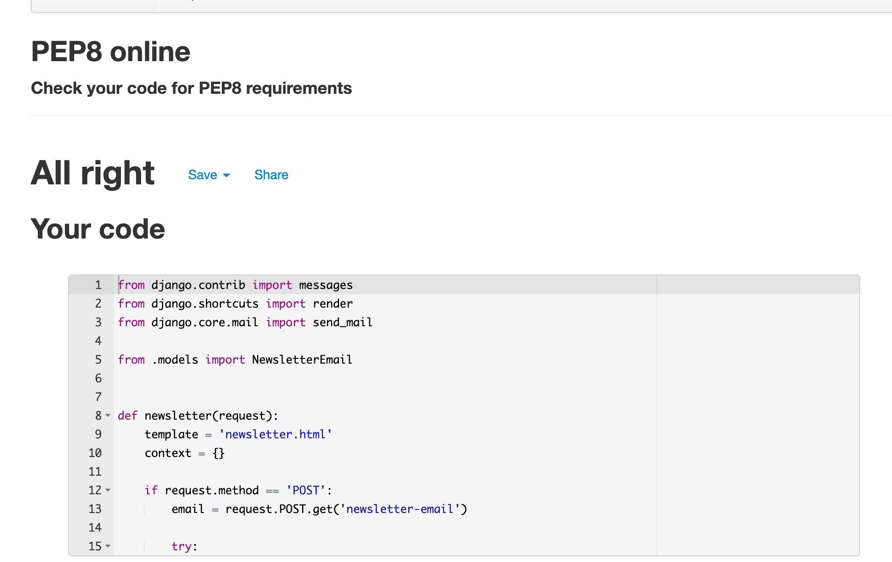

### JavaScript
My JavaScript file passed through the JSHint validation without any errors.
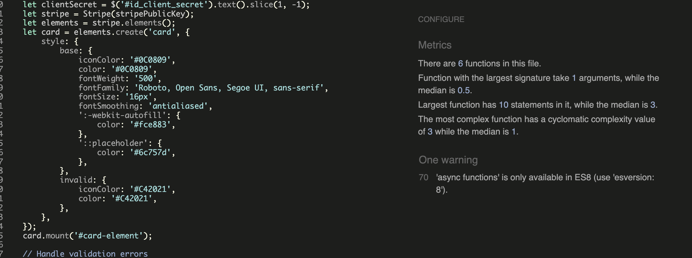

### LIGHTHOUSE
See the results for lighthouse testing:
You can see the results [here](https://github.com/Damianjacob/MS5-Music-Pro-2/tree/main/assets/images/validation).

### Functionality Testing

#### Products and product details page 

##### Pagination, sorting and categories

In order to test that the products page works correctly, I created fixtures for the product model. Using the site [Mockaroo](https://mockaroo.com/), I created 1000 fake products which I then loaded into my database. The main goal was to use a large number of products to see whether the pagination, category and sorting functionalities worked well together. I have used a custom template tag (see products/templatetags/templatehelpers.py) because at the beginning there were some issues, especially regarding the pagination: When going to a different page, any sorting or category would be reset, making it impossible to use those features. Thanks to the "relative_url" template tag, this issue was resolved.

__Successful testing scenarios__:

- Select a category and go to next page. The "category" is maintained on the next page as well.
- Select a category and a "Sort by" option. Both are maintained when going to the next page.
- Select a "Sort by" option, then a category. Both are maintained, even when going to the next page.
- Enter a search term, then select a category. The results for the search term are now filtered by that category.
- Select a category and a sorting option, then click on one product. When clicking on the "Keep Shopping" button, the category and sorting option are still there.
- When no result is found for either a search query or a category, or a search query filtered by a certain category, a specific message is displayed.

- The pagination is based on the Django example but has been customised. I have tested various edge cases to make sure that the pagination display makes sense, for example when there are only two pages or only one page.

##### Privilege-based features

__Successful testing scenarios__:

- When logged in as the owner, the "edit or restock" and "delete" buttons are visible on each product
- The "edit or restock" and "delete" buttons can be interacted with even when a product is unavailable, and thus cannot be accessed.
- When logged in as a normal user, the "edit and restock" and "delete" buttons are invisible
- When not logged in, the "edit and restock" and "delete" buttons are invisible
- On the product details page, only registered users can leave a rating, otherwise the rating form is invisible
- Only registered users can submit a question. If a user is not logged it, they are redirected to the login page.
- Only the site owner can leave replies to questions. A normal user will not see the "Owner reply" form.
- Both anonymous users and registered users can add items to the cart, get notified when items are added, and can easily modify the quantity from the product details page.

#### Cart page

__Successful testing scenarios__:

- Both registered and anonymous users can update the quantity of each item simply by selecting a new number from the dropdown.
- Registered and anonymous users can delete products from the cart.

#### Checkout page

__Successful testing scenarios__:
- The shipping form throws an error if one of the required fields is not filled or if it is filled incorrectly (only after trying to submit)
- The payment form will show a red error message if the card number is incomplete or incorrect, even without submitting
- After a successful payment, a confirmation email is sent to the email address from the form and a success message is displayed on the site.

#### Profile page

##### For registered users
__Successful testing scenarios__:
- For registerd normal users, their Default delivery information is displayed
- Their order history is displayed
- By clicking on one order of the order history, they can see all the details of that order
- They can update their default delivery information by clicking on the update information button.

##### For site owners
__Successful testing scenarios__:
- Site owners have access to the "Product Management" and the "User Questions" menu options.
- In "Product Management", they can create a new product by entering all the information necessary. Uploading images works without any issues.
- In "User Questions" site owners can see two tables: one with unanswered user questions, the other one with answered user questions.
- When the site owner submits a reply in the "User questions view", they get redirected to the same page and the question will disappear in the "unanswered" table and appear in the "answered" table.
- By clicking on a product name, they get to the product details page of that product.

#### Newsletter page
__Successful testing scenarios__:
- If an user is already subscribed, they will be informed of that and they won't receive any confirmation email.
- If an user is not yet subscribed, they will receive a confirmation message on the site and a confirmation email.

### Devices and Responsiveness Testing
I tested the responsiveness of my site by testing different dimensions in the web inspectors of various browsers and testing them directly on my mobile device.
Testing for responsiveness was performed successfully with the following devices:

#### Device: Mac Mini
##### Browser: Google Chrome
- Dimensions: iPhone SE. All pages are responsive, user questions tables are responsive.
- Dimensions: iPhone XR. All pages are responsive, user questions tables are responsive.
- Dimensions: iPhone 12 Pro. All pages are responsive, user questions tables are responsive.
- Dimensions: Pixel 5. All pages are responsive, user questions tables are responsive.
- Dimensions: Samsung Galaxy S8+. All pages are responsive, user questions tables are responsive.
- Dimensions: Samsung Galaxy S20 Ultra. All pages are responsive, user questions tables are responsive.
- Dimensions: iPad Air. All pages are responsive, user questions tables are responsive.
- Dimensions: Full Screen. All pages are responsive.

##### Browser: Firefox
- Dimensions: I tried different dimensions, and paid attention that the breakpoints worked as intended. They did, and the tables were responsive on smaller screen sizes.

##### Browser: Safari
- Dimensions: Same as with Firefox: I tried different dimensions, and paid attention that the breakpoints worked as intended. They did, and the tables were responsive on smaller screen sizes. As opposed to Firefox and Chrome, Safari has a dedicated "Responsive Design" mode, which we have to access for testing different dimensions.

## Bugs

- While trying to run the server after having set up Amazon S3 as default file storage, I had issues accessing my admin page. It raised "ValueError: Required parameter name not set" and pointed to the Django static tag where the CSS link was defined. 
Fix: In settings.py I deleted the STATICFILES_STORAGE variable (which I had set to the boto link, needed for AWS) and only left DEFAULT_FILE_STORAGE. This resolved the issue.

- My first deployment caused the Heroku app to crash. This was because in the Procfile I had used the Heroku app name instead of the Django project name.
Fix: Changed "[heroku-appname].wsgi" to "[django-projectname].wsgi"

- When trying to log into my admin page, I got a "Forbidden" error where it demanded a CSRF token (which should already be taken care of).
Fix: clear cookies from browser. https://stackoverflow.com/questions/29573163/django-admin-login-suddenly-demanding-csrf-token

## Deployment

### Creating the Github repository and cloning it
- Go to Github to your profile
- Go to repositories and click on "New"
- Choose a name and the settings you prefer, then click on "create repository"
- Go to the repository
- Click on "code", and copy the HTTPS address
- In VSCode, click on "Clone Git repository"
- Paste the address of your repository and press enter. 

### Creating a virtual environment, the requirements.txt file and env.py file
Before starting to code on your machine, it's important to create a virtual environment. 
This avoids cluttering the requirements.txt file with all the Python modules you have installed on your machine, and it avoids installing any Python moduels you won't need in your project.

#### Virtual environment
- In your IDE (for example VSCode), open a terminal
- Use the following command to install venv: "python3 -m venv /path/to/new/virtual/environment". This has to be the root folder of your Django project.
- A new folder called "venv" will be created.
- Activate the virtual environment by typing the command "source venv/bin/activate"

#### Requirements.txt
- In the root folder of your Django project, create the file "requirements.txt"
- Make sure to store all the requirements in the requirements.txt file before you push to your deployed website. The command to do so is "pip3 freeze --local > requirements.txt". This will collect all the Python modules you have installed in your virtual environment and write them down in the requirements.txt file.

#### Environment variables and the env.py file
Environment variables are things like secre API keys, which must not be publicly accessible for security reasons. On your local environment, you should store them in a file called "env.py", which will only be accessible from your own machine.

- In the root folder of your Django project, create a file called "env.py"
- There should be a file called ".gitignore" in your root directory. If it doesn't exist, create it.
- Add "env.py" without any quotation marks to the .gitignore file. Any files in .gitignore will not be pushed to Github.

### Deploying to Heroku
- Create account at Heroku
- Create new app, give it a name and select your region
- Go to Settings
- Under Config Vars add your secret data (for example environment variables like API keys), which will be in the env.py file in the local environment. You need to copy all the environments variables from your local environment to the config vars.
- Add Heroku Postgres Add-on
- In the deployment tab, select the preferred deployment method (for this project, I used Heroku Git because of Heroku-GitHub issues)
- Follow the instructions on Heroku after you chose your deployment method. This may include downloading the Heroku CLI, logging in to the Heroku CLI and cloning the repository.
- If you chose "Heroku Git" as your deployment method, you will have to push all your commits twice: once to GitHub by using the command "git push" and once to Heroku with the command "git push heroku main".
- For any issues it's useful to consult the build log in the activity tab
- Before going public, it's very important to set DEBUG to false in the django settings.py file.

## Credits

### Tutorials and other resources

I have used the [Django Tutorial](https://docs.djangoproject.com/en/4.0/intro/tutorial01/) and read the Django documentation extensively during the creation of this project.

Tutorial followed to use AWS for file storage: https://www.section.io/engineering-education/using-amazon-web-service-for-django-media-files-storage/#setting-up-the-django-application

Documentation for using AWS' S3 service with the django-storage library : https://django-storages.readthedocs.io/en/latest/backends/amazon-S3.html

YouTube tutorial on how to set up AWS S3 for file storage: https://www.youtube.com/watch?v=nzLMA9WZqMM

Custom template tag for keeping querystrings when going to another page or to a different category
https://simpleisbetterthancomplex.com/snippet/2016/08/22/dealing-with-querystring-parameters.html

I have followed the walkthrough project extensively and some parts of my code are structured in a similar way.

## Acknowledgements

I want to thank my mentor Narender Singh for his guidance and his precious advice. Thank you to all the tutors who had the patience to help me and to point me in the right direction when I was lost... You folks are awesome! Thank you to my fellow students and to everyone on the Slack channel, there is so much good advice on there. 
Last but not least, thanks to Reddit and Stackoverflow.

This was the most challenging project I have ever done, and I could not have made it without help from other people, both directly and indirectly.